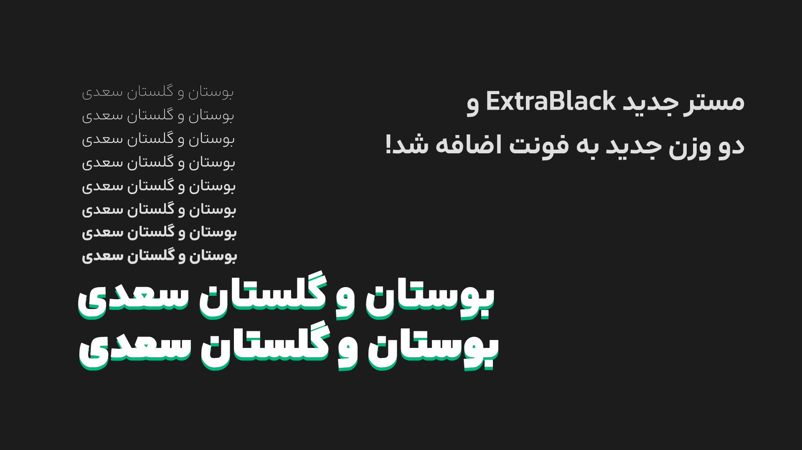
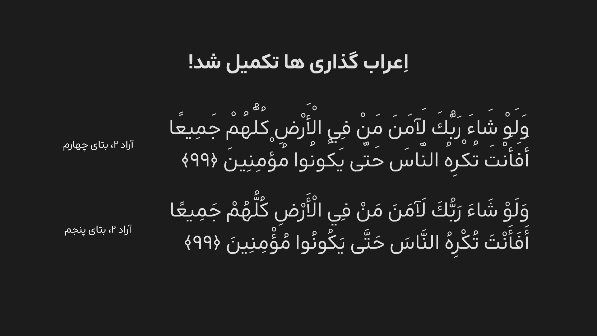

# Arad Changelog

## 2.1.0

۷ آذر ۱۴۰۴

- تغییر جزئی فرم «عـ» و «ع»
- تغییر فرم حلقه حروف «ح،خ،چ،ج،ع» و فرم انتهایی این حروف
- بازبینی فرم نقطه (period)
- طراحی ویرگول فارسی تغییر کرد
- طراحی گیومه فارسی تغییر کرد
- هفتک حروف ێ، برخلاف قبل، حالا تنظیم‌تر شده 
- مشکلات کوچکی در هماهنگی متن فارسی و انگلیسی بود که برطرف شد
- هماهنگی بیشتر اِعراب با همدیگر
- اصلاح اِعراب‌گذاری چند حرف
- رفع مشکل ویژگی tnum برای اعداد انگلیسی
- پکیج فونت، تغییراتی داشت
و...

## 2.0.0

۱ آذر ۱۴۰۴

نسخۀ کامل بروزرسانی فونت آراد منتشر شد!
- اضافه شدن علائم ارز های تومان و ریال و درهم
- جایگزین ها، و قابلیت های جدیدی در استایلتیک ست ها و ویژگی های اوپن‌تایپ دیگر قرار گرفتند
- - تراز عمودی اعداد اضافه شد
- - انواع جایگزین های «ی» و کاف و گاف، در دسترس قرار گرفتند
- ریزه کاری های مختلفی انجام شد تا فونت برای انتشار نهایی آماده باشد
- باگ های مختلف برطرف شد

## 2.0.0 Beta5

۲۵ مهر ۱۴۰۴

- مستر سنگین ExtraBlack و دو وزن جدید به فونت اضافه شد!
- طراحی بسیاری از حروف و اعداد مخصوصاً در مستر ExtraBold تغییر کرد. مثل کاف م اً
- بعضی از حروف برای بهبود در وزن های سنگین فرضی، در anchor ها و handle ها، دچار تغییراتی شدند که ممکن است تاثیر محسوسی بر طراحی حرف نداشته باشد.
- اعراب‌گذاری ها تکمیل شد.
- فاصلۀ بین خطوط بیشتر شد.
- باگ های مختلف برطرف شد.
- کرنینگ ها، دچار تغییرات جزئی شدند.
- بعضی جایگزین های شرطی، تغییر جزئی کردند.
- فرم نقطۀ چهار، به دلیل استفاده کم، مناسب نبودن برای شخصیت فونت، و مطابق نبودن با استاندارد های وزن های سنگین‌تر، از فونت حذف شد.
- و تغییرات دیگری که در اینجا اشاره نشدند.

## 2.0.0 Beta4

۱۸ مهر ۱۴۰۴

- طراحی بعضی حروف تغییر کرد.

- بعضی از حروف برای بهبود در وزن های سنگین فرضی، در anchor ها و handle ها، دچار تغییراتی شدند که ممکن است تاثیر محسوسی بر طراحی حرف نداشته باشد.

- علامت سوال و علامت تعجب در اندازه و طراحی تغییراتی داشتند.

- موارد فیچر calt، به rlig منتقل شدند تا فونت عملکرد بهتری در نرم افزار های قدیمی داشته باشد.

- کرنینگ حروف فارسی کاملاً بازنویسی شد.

- رفع ایراد جزئی در جایگزین های شرطی «ٹ‍»

- رفع اشکال جایگزین های شرطی مربوط به «ێ‍» و «‍ێ‍»

- و تغییرات دیگری، که در اینجا اشاره نشدند.

## 2.0.0 Beta3

۱۶ مهر ۱۴۰۴

- طراحی بعضی حروف تغییر کرد
- حروف تغییر یافته زبان انگلیسی اضافه شد، و کرنینگ های زبان انگلیسی منتقل شدند و حالا در فونت وجود دارند. این به معنای آن است که طراحی زبان انگلیسی به مراحل آخر خود رسیده است.

## 2.0.0 Beta2

۲۶ شهریور ۱۴۰۴

طراحی بعضی حروف تغییر کرد.
تعدادی از گلیف های بی‌استفاده حذف شد.
نام‌گذاری نسخه های بتا تغییر کرد.

## 2.0.0 Beta1

۱۲ مرداد ۱۴۰۴

نسخۀ بتا در دسترس قرار گرفت.

## ۱,۱

۲۵ مهر ۱۴۰۳

- نوع دوم «ف» کمی بهتر شد، و جایگزین نوع اول «ف» در تمامی وزن ها شد
- حروفی مانند «ن»، «ل»، «ی» و ... مشکل خطای دید داشتند که با تغییراتی، این موضوعات تا حدی رفع شد
- فونت به طور کلی بزرگ تر شد و نسبت سطح به دور آن کمتر شد
- تغییر کوچک در «ححح ح»
- تغییر در ارتفاع قرارگیری حروف عین و ح

## ۱,۰,۱

۳۱ شهریور ۱۴۰۳

- اندازۀ فونت کمی بزرگ تر شد
- تغییر جزئی بعضی حروف، و بازطراحی «فـ،قـ،و...»
- تغییر جزئی نام‌گذاری
- بازبینی کرنینگ مربوط به «آ»

## ۱.۰v

نسخۀ رسمی آراد منتشر شد!

۹ شهریور ۱۴۰۳

- سایت در دسترس قرار گرفت
- اضافه شدن زبان تورکجه به اسکریپت ها
- اضافه شدن نقاط دایره به فونت
- تغییرات جزئی در تناسبات بعضی حروف
- تغییر و انتقال فیچر calt به rclt
- تغییراتی در عرض و فاصلۀ حروف انگلیسی، برای تناسب بیشتر با حروف فارسی
- تغییر جزئی در نام‌گذاری و پوشه ها
- رفع اشکال جایگزین شرطی «ر» برای «بـ»
- اصلاح فاصلۀ حروف الف و لام و لیگچر های مربوط
- اضافه کردن چند کرنینگ
- تغییر شکل علامت سوال عربی
- و...

## ۰.۹.۲

۱۲ مرداد ۱۴۰۳

- بازبینی نقاط و اصلاح آنها
- خروجی برای حالت نقاط فرعی
- سازمانی دهی اسم فونت(هنگامی که تنظیمات محور متغیر شخصی سازی شده باشد)
- تغییر نقطۀ «ج»
- رفع اشکال جایگزین شرطی «ر» برای «جـ» «چـ»
- رفع مشکل نقاط [لینک](https://github.com/MDarvishi5124/Arad/issues/3)

## ۰.۹.۱.۱

۹ مرداد ۱۴۰۳

نسخه های وربیل و سورس فونت، دچار مشکل در قسمت instances بودند، که باعث مشکل در نصب می‌شد. این مشکل رفع شد.

## ۰,۹,۱

۸ مرداد ۱۴۰۳

- سورس فونت قرار گرفت
- اسم نسخه ها، دچار تغییر شد
- 
- اصلاح ارتفاع قرار گیری ح ج چ خ ع غ(آزمایشی)
- بزرگ‌تر شدن عرض حرف ر
- رفع اشکال تبدیل نقطه به اعشار در ss01
- رفع مشکل قسمت همپوشانی حرف میم و طا [لینک](https://github.com/MDarvishi5124/Arad/issues/2)
- رفع مشکل اعراب‌گذاری بر روی استایل ExtraBold Dots1 و که منجر به مشکلات اِعراب گذاری و نقاط میشد.

کرنینگ ها:
- اصلاح کرنینگ «آ» و «گ»
- اصلاح کرنینگ «آ» و «ل»
- رفع اشکال کرنینگ های اعداد و علائم
- اضافه کردن کرنینگ مثبت بین دال و علائم
- رفع اشکال کرنینگ حروف و اعداد انگلیسی
- و...

## ۰,۹
۵ مرداد ۱۴۰۳

آراد منتشر شد.

برای مشاهده تاریخچه فونت آراد به [این صفحه](https://github.com/MDarvishi5124/Arad/CHANGELOG.md) مراجعه نمایید.

