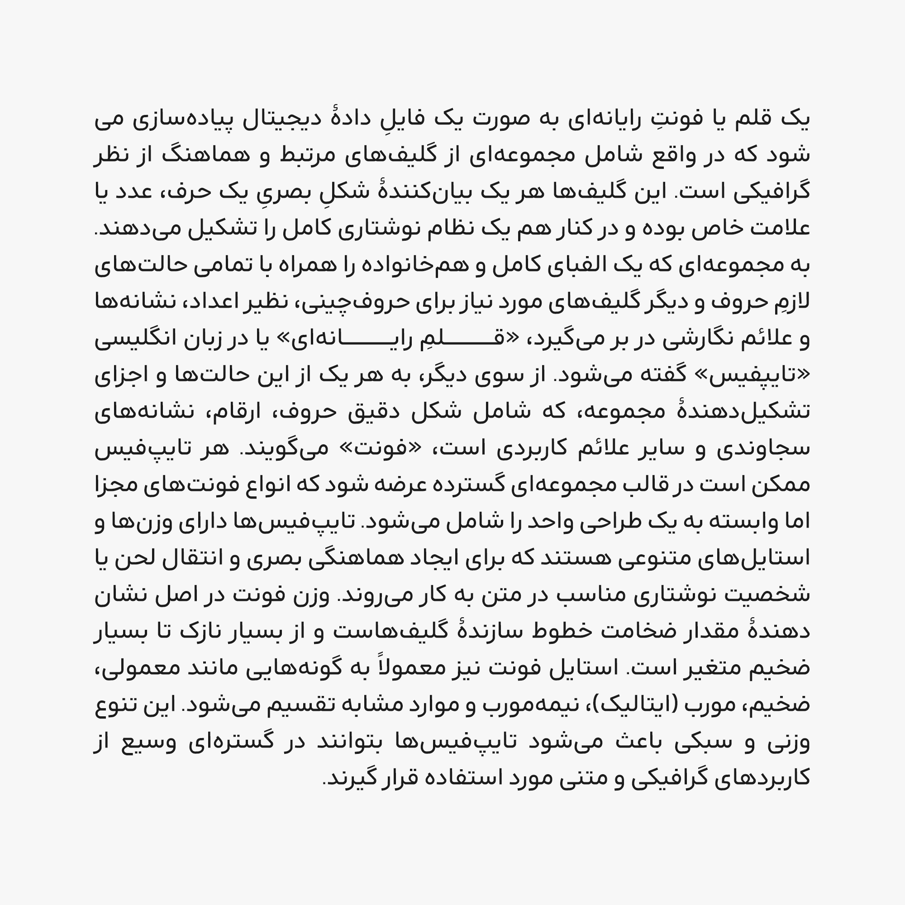

# Arad

<li><a href="https://mohamaddarvishi.ir/Arad/">صفحۀ اصلی پروژه</a></li>
<li><a href="https://mohamaddarvishi.ir/Arad/docs/">راهنما</a></li>
<li><a href="https://mohamaddarvishi.ir/Arad/changelog/">فهرست تغییرات</a></li>
<li><a href="https://daramet.com/mdarvishi5124">حمایت مالی</a></li>

### چه چیز هایی برای انجام وجود دارد؟
- مواردی که گزارش می‌شود

## مشارکت غیرفنی در فونت آراد
- حمایت مالی و معرفی فونت به افراد دیگر
- بنظر می‌آید فونت آراد، در زبان های کوردی و اردو، حروف جایگزین شرطی، به طور کامل و دقیق پیاده سازی نشدند. باید فونت در این زبان ها آزمایش شود