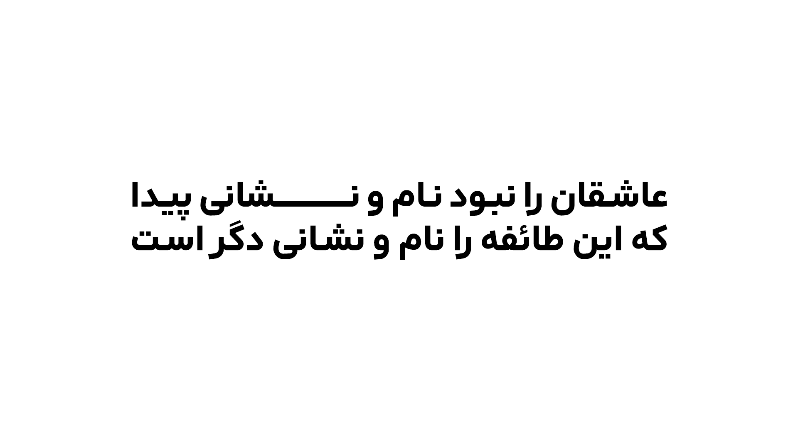

# Arad

<li><a href="https://mohamaddarvishi.ir/Arad/fa/">صفحۀ اصلی پروژه</a></li>
<li><a href="https://daramet.com/mdarvishi5124">حمایت مالی</a></li>
<li><a href="https://github.com/MohamadDarvishi/Arad/blob/main/CHANGELOG.md">فهرست تغییرات</a></li>

### چه چیز هایی برای اصلاح وجود دارد؟
- اضافه کردن وزن جدید بر اساس محور متغیر فونت
- تصحیح اِعراب گذاری ها
- و...

## مشارکت غیرفنی در فونت آراد
- بنظر می‌آید فونت آراد، در زبان های کوردی و اردو، حروف جایگزین شرطی، به طور کامل و دقیق پیاده سازی نشدند. باید فونت در این زبان ها آزمایش شود.
