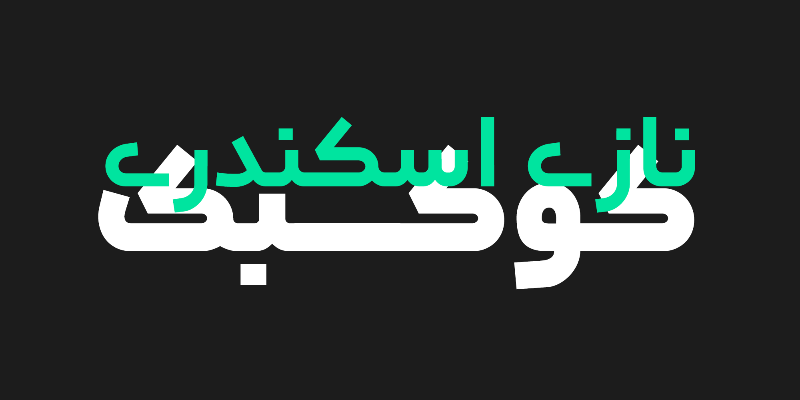
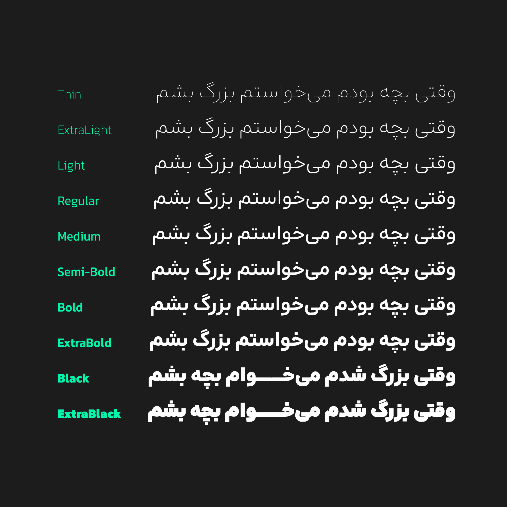
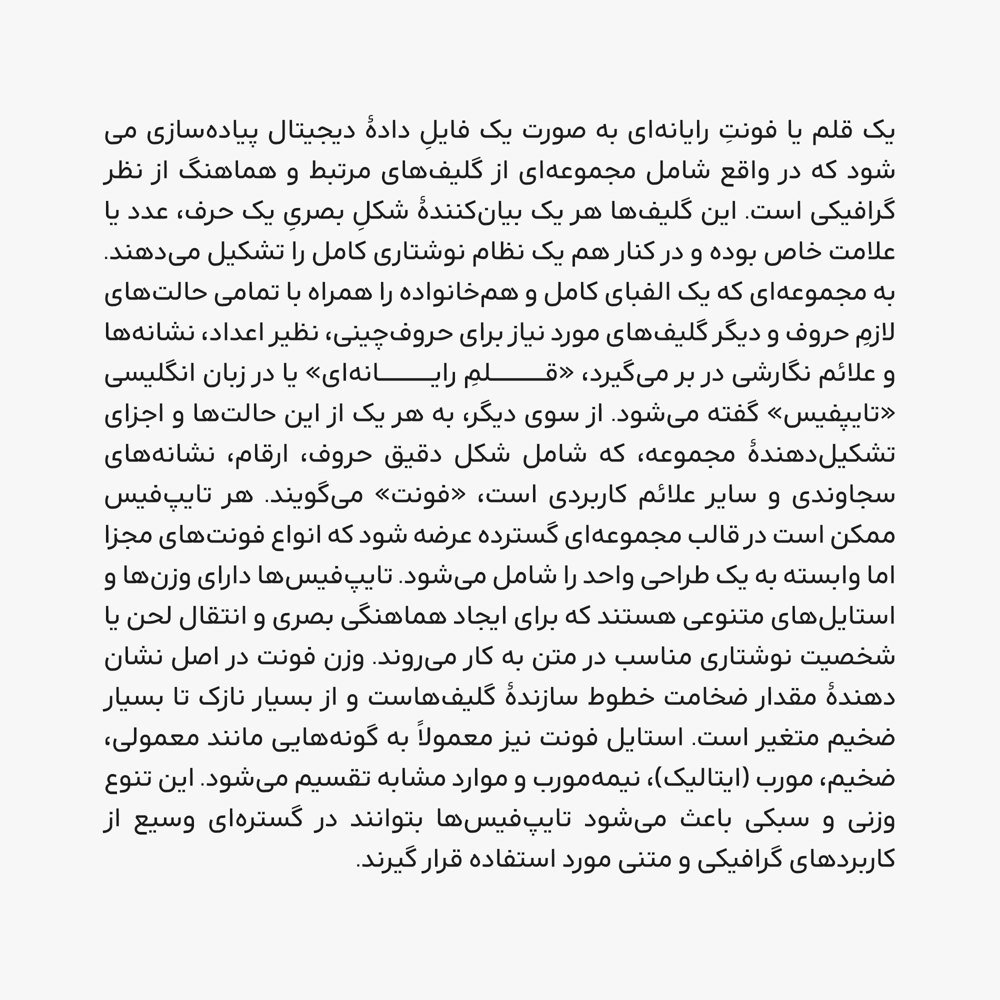

# Arad


<li><a href="https://mohamaddarvishi.ir/Arad/">صفحۀ اصلی پروژه</a></li>
<li><a href="https://mohamaddarvishi.ir/Arad/docs/">راهنما</a></li>
<li><a href="https://mohamaddarvishi.ir/Arad/changelog/">فهرست تغییرات</a></li>
<li><a href="https://mohamaddarvishi.ir/Arad/donate/">حمایت مالی</a></li>





## مخزن های مرتبط با فونت آراد
<li><a href="https://github.com/sajjad85gh/Arad-Font-Module">Arad Font Magisk Module</a></li>


## نصب از AUR

فونت آراد در [AUR](https://aur.archlinux.org/packages/arad-fonts) برای دانلود و نصب بر روی توزیع‌های برپایه آرچ در دسترس است.

```bash
paru/yay -S arad-fonts #Using Aur Helper

git clone https://aur.archlinux.org/arad-fonts
cd arad-fonts
makepkg -sic #manual

```


## چه چیز هایی برای انجام وجود دارد؟
- مواردی که گزارش می‌شود

## مشارکت غیرفنی در فونت آراد
- حمایت مالی و معرفی فونت به افراد دیگر
- بنظر می‌آید فونت آراد، در زبان های کوردی و اردو، حروف جایگزین شرطی، به طور کامل و دقیق پیاده سازی نشدند. باید فونت در این زبان ها آزمایش شود
